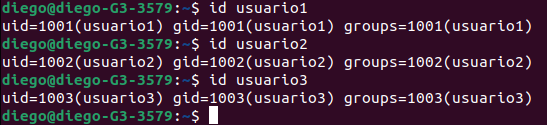
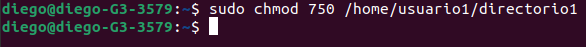

 

## Actividad 3

Detalles

- Objetivo: Familiarizar a los estudiantes con la administración de usuarios, grupos y permisos en un sistema operativo Linux.
- Requisitos previos: Tener instalado un sistema Linux y acceso al terminal.
- Envio: Enviar Link al folder actividad3 de su repositorio de GitHub

Instrucciones

Crear un md file y resolver cada uno de los items solicitados a continución. Debe de colocar el comando utilizado asi como el resultado de este si es necesario. 

 Parte 1: Gestión de Usuarios 

1. Creación de Usuarios: Crea tres usuarios llamados `usuario1`, `usuario2` y `usuario3`.

2. Asignación de Contraseñas: Establece una nueva contraseñas para cada usuario creado.

3. Información de Usuarios: Muestra la información de `usuario1` usando el comando `id`.

4. Eliminación de Usuarios: Elimina `usuario3`, pero conserva su directorio principal.

 Parte 2: Gestión de Grupos 

1. Creación de Grupos: Crea dos grupos llamados `grupo1` y `grupo2`.

2. Agregar Usuarios a Grupos: Agrega `usuario1` a `grupo1` y `usuario2` a `grupo2`.

3. Verificar Membresía: Verifica que los usuarios han sido agregados a los grupos utilizando el comando `groups`.

4. Eliminar Grupo: Elimina `grupo2`.

 Parte 3: Gestión de Permisos 

1. Creación de Archivos y Directorios:

- Como `usuario1`, crea un archivo llamado `archivo1.txt` en su directorio principal y escribe algo en él.
- Crea un directorio llamado `directorio1` y dentro de ese directorio, un archivo llamado `archivo2.txt`.

2. Verificar Permisos: Verifica los permisos del archivo y directorio usando el comando `ls -l` y `ls -ld` respectivamente.

3. Modificar Permisos usando `chmod` con Modo Numérico: Cambia los permisos del `archivo1.txt` para que sólo `usuario1` pueda leer y escribir (permisos `rw-`), el grupo pueda leer (permisos `r--`) y nadie más pueda hacer nada.

4. Modificar Permisos usando `chmod` con Modo Simbólico: Agrega permiso de ejecución al propietario del `archivo2.txt`.

5. Cambiar el Grupo Propietario: Cambia el grupo propietario de `archivo2.txt` a `grupo1`.

6. Configurar Permisos de Directorio: Cambia los permisos del `directorio1` para que sólo el propietario pueda entrar (permisos `rwx`), el grupo pueda listar contenidos pero no entrar (permisos `r--`), y otros no puedan hacer nada.

7. Comprobación de Acceso: Intenta acceder al `archivo1.txt` y `directorio1/archivo2.txt` como `usuario2`. Nota cómo el permiso de directorio afecta el acceso a los archivos dentro de él.

8. Verificación Final: Verifica los permisos y propietario de los archivos y directorio nuevamente con `ls -l` y `ls -ld`.

 

**Reflexión: (Opcional)**

Contestar las siguientes preguntas:

- ¿Por qué es importante gestionar correctamente los usuarios y permisos en un sistema operativo?
- ¿Qué otros comandos o técnicas conocen para gestionar permisos en Linux?

## SOLUCIÓN
### PARTE 1

### Creación de Usuarios

Debemos de crear 3 usuarios, para esto se utilizará el comando **'sudo useradd nuevo_usuario'**. Ejecutando el comando:

### Asignación de Contraseñas

Se debe de asignar contraseñas a los usuarios creados previamente, utilizaremos el comando **'sudo passwd nuevo_usuario'**. Ejecutando el Comando:

### Información de Usuarios

Mostrar la información de los usuarios recien creados, utilizaremos el comando **'id nuevo_usuario'**

### Eliminación de Usuario

Eliminamos el usuario 3 conservando su directorio principal utilizando el comando **'sudo userdel usuario3'**. Ejecutando el comando:

### PARTE 2

### Creación de Grupos

Para la creación de grupos utilizaremos el comando **'sudo groupadd grupoX'**. Ejecutando el comando

### Agregar Usuarios a los grupos

Para poder agregar usuarios a los grupos que creamos es necesario usar el comando **'sudo usermod -aG grupo1 usuario1'**. Ejecutando el comando:

### Verificar membresía

Para verificar la membresía es necesario ejecutar el siguiente comando **'groups usuarioX'**. Ejecutando el comando:

### Eliminar Grupos

Para poder eliminar grupos se debe de ejecutar el comando **'sudo groupdel grupoX'**. Ejecutando el comando:

 

### Parte 3

### Creación de archivos y directorios

Primero debemos de iniciar sesión con el usuario1, que es con el que trabajaremos esta parte, para esto debemos ejecutar el comando **'su -usuario1'** luego podremos ejecutar la creación de archivos y directorios para ese usuario. para crear el archivo utilizaremos el siguiente comando: **'echo "Hola mundo archivo 1" > archivo1.txt'** para crear el directorio utilizaremos -> **'mkdir directorio1'** por ultimo para crear el archivo2 en el directorio1 debemos de movernos dentro del directorio usando **'cd directorio1'** y crear el archivo con el comando -> **'echo "Hola mundo archivo 2" > archivo2.txt'**. Ejecutando los comandos: 

### Verificar permisos

Para verificar los permisos de nuestros archivos y directorios debemos de ejecutar los siguientes comandos: **'ls -l /home/usuario1/archivo1.txt'** este verifica los permisos para nuestro archivo y el siguiente verifica los permisos para nuestro directorio: **'ls -ld /home/usuario1/directorio1'**

### Modificar Permisos usando `chmod` con Modo Numérico

Para modificar los permisos utilizando chmod ejecutaremos el siguiente comando: **'chmod 640 /ruta/completa/del/archivo1.txt'** donde el 640 son los permisos para lectura y escritura. Ejecutando el comand:

### Modificar Permisos usando `chmod` con Modo Simbólico

Para modificar los permisos utilizando chmod ejecutaremos el siguiente comando: **'chmod u+x /ruta/completa/del/directorio1/archivo2.txt'** donde el u+x son los permisos para ejecución para el propietario del archivo2.txt. Ejecutando el comando:

### Cambiar el Grupo Propietario

para cambiar el grupo propietario de un archivo es necesario ejecutar el siguiente comando, en este caso lo cambiaremos al grupo1 **'sudo chown :grupo1 /home/usuario1/directorio1/archivo2.txt'**

### Configurar Permisos de Directorio

Configurar permisos de directorio se realiza con el siguiente comando: **'chmod 750 /home/usuario1/directorio1'**

### Comprobación de Acceso

Intenta acceder al `archivo1.txt` y `directorio1/archivo2.txt` como `usuario2`. Nota cómo el permiso de directorio afecta el acceso a los archivos dentro de él.

### Verificación FINAL

Verifica los permisos y propietario de los archivos y directorio nuevamente con `ls -l` y `ls -ld`.

### ¿Por qué es importante gestionar correctamente los usuarios y permisos en un sistema operativo?

Es importante gestionar correctamente usuarios y permisos principalmente por seguridad, ya que al tener bien marcados los permisos y que usuarios son los que trabajan en un sistema se puede generar control de accesos, una auditoria y seguimiento de cualquier situación que pueda surgir así como prevención de malware que pueda alojarse en nuestro sistema si estuviese libre de permisos.

